# vijPlots

[jamovi](https://www.jamovi.org) module as ggplot2 wrapper to generate basic stats plots (histogram, boxplot, barplot, piechart,...) with many options along with Multiple Response and Likert Barplots.

## Histogram

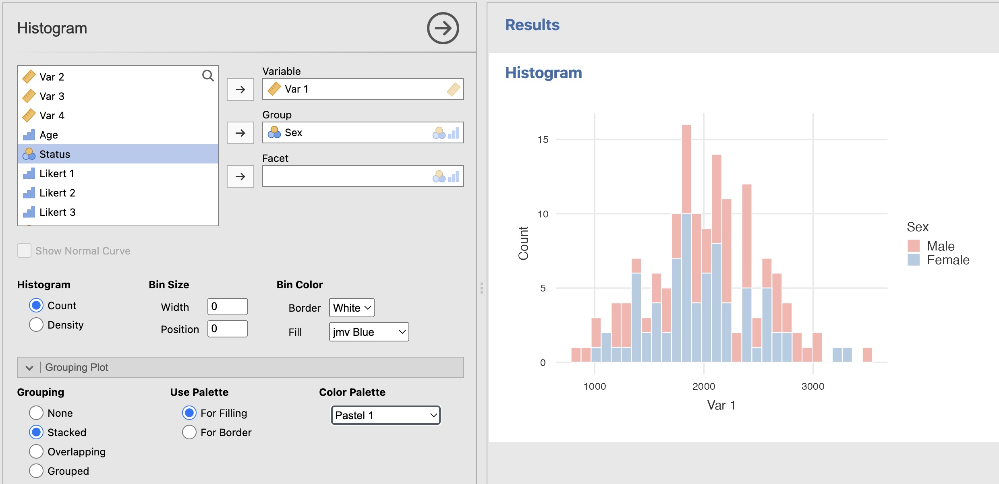

## Box Plot

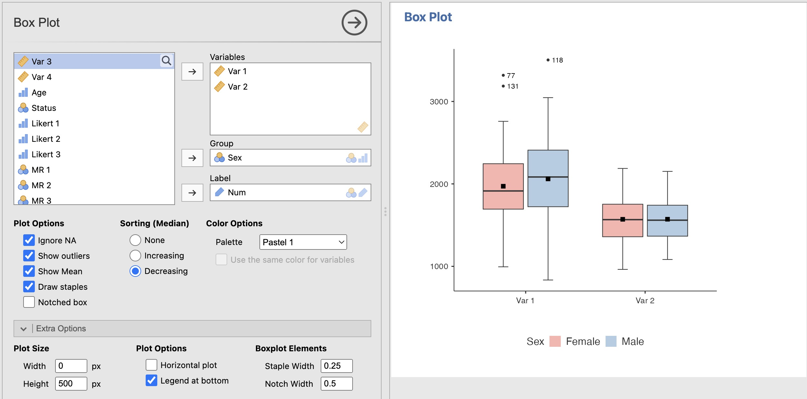

## Scatter Plot

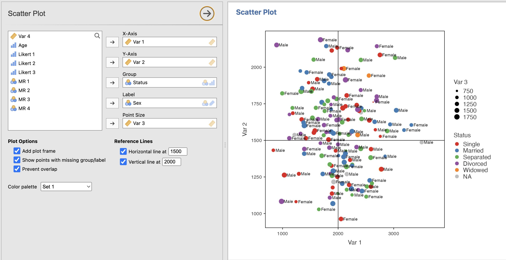

## Lollipop Plot

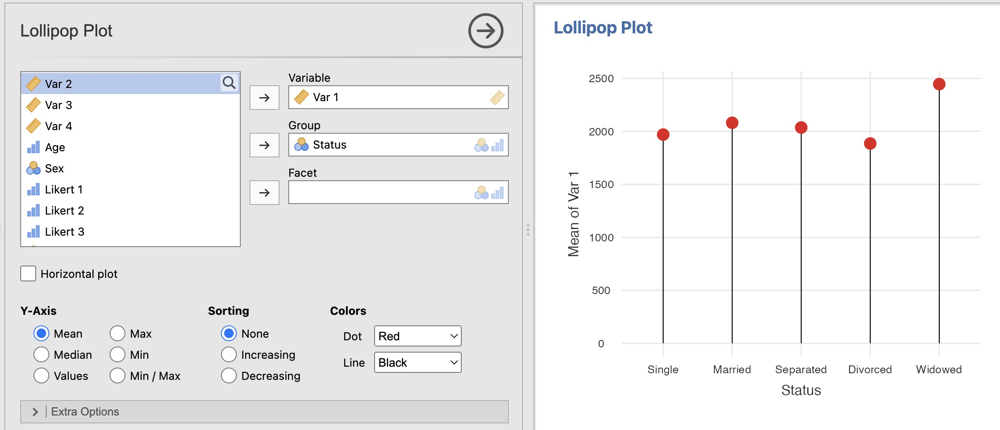

## Bar Plot

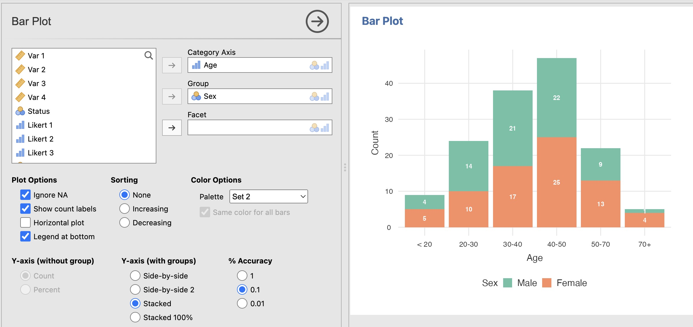

## Pie Chart

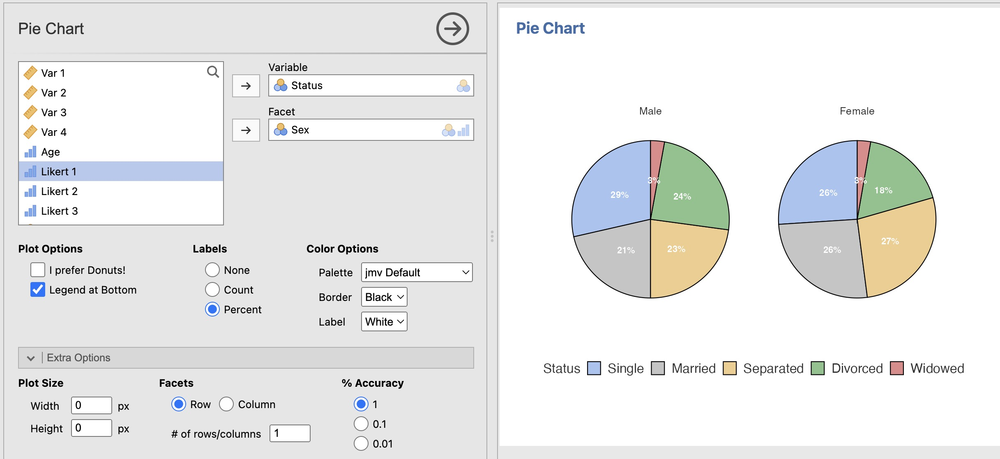

## Likert Plot

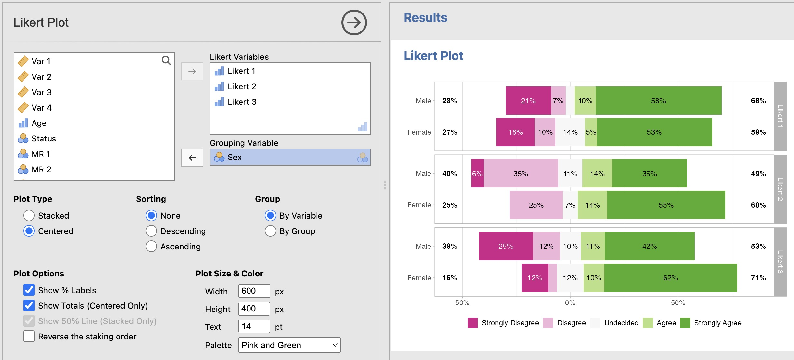

## Multiple Responses

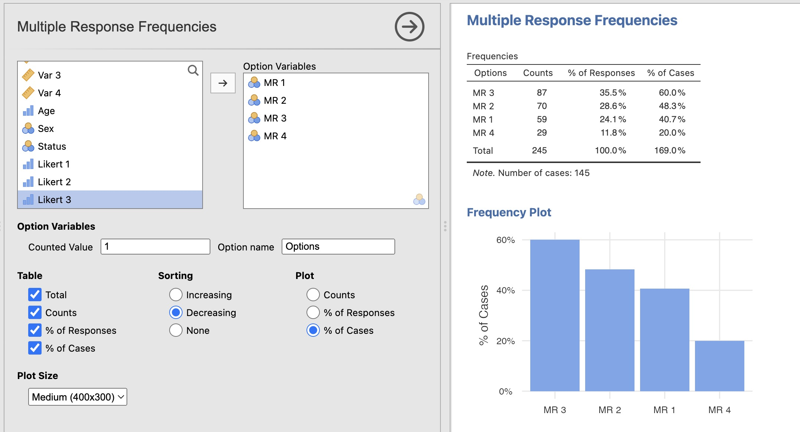

## Line Charts

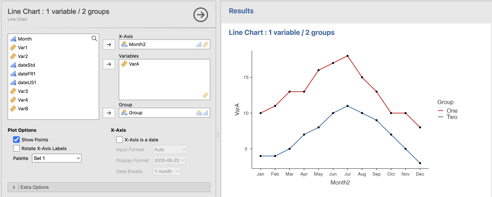

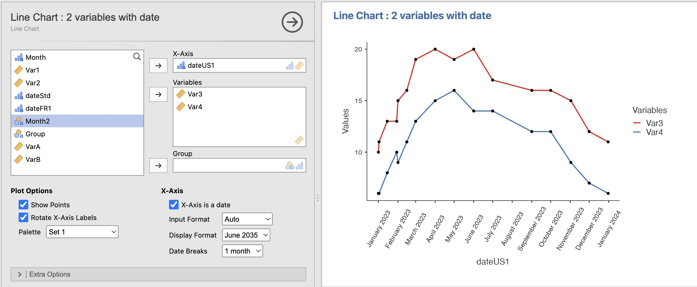

## Area Chart

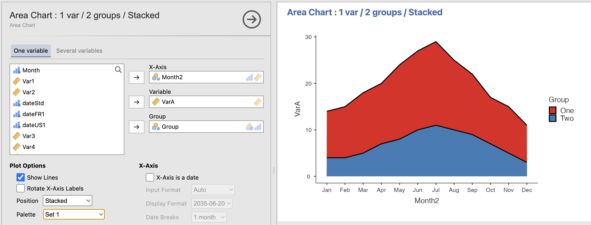

## Version history

### 2024-12-11 / 0.7.0 (beta)

-   Line Chart
-   Area Chart
-   Option "Auto" for text color in Barchart and Piechart using ggstats::hex_bw()
-   Sort (by median) in Boxplot
-   Color Options in Multiple Response Frequencies & Crosstab
-   Option to convert variables to integer in Likert Plot.
-   Likert Plot can plot a single variable

### 2024-11-10 / 0.6.0 (beta)

-   Lollipop plot
-   Improve normal curve in histogram using ggh4x

### 2024-11-01 / 0.5.0 (beta)

-   French translation
-   bug fixes

### 2024-10-27 / 0.4.0 (alpha)

-   barplot and scatterplot geom wrappers added.
-   merged with vijMR (multiple response) and vijLikert

### 2024-10-21 / 0.2.0 (alpha)

-   boxplot and pie chart geom wrappers added.

### 2024-10-15 / 0.1.0 (alpha)

-   First public release with histogram geom wrapper.
